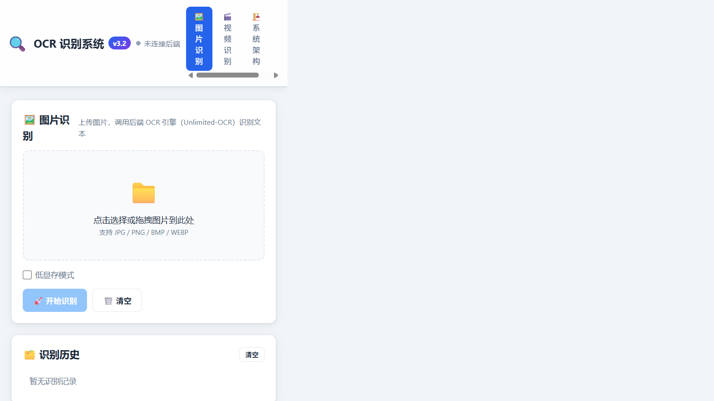
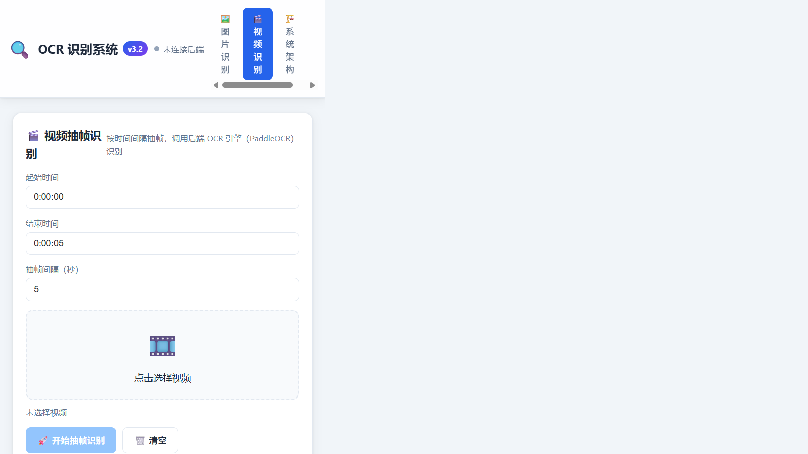
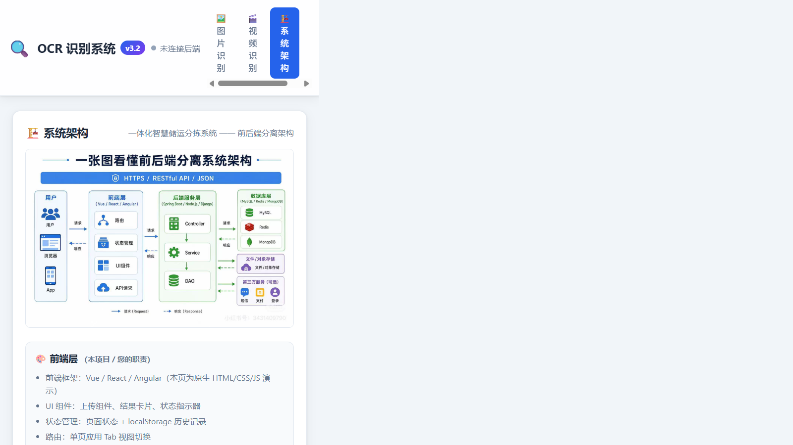
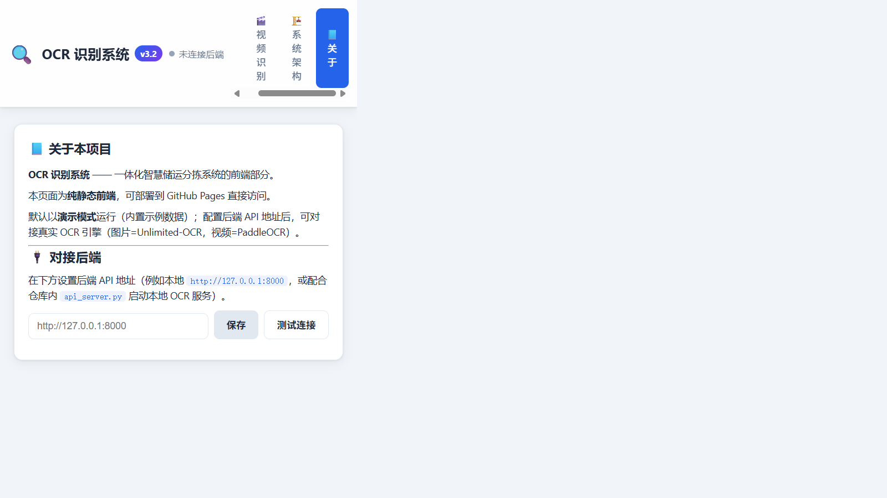
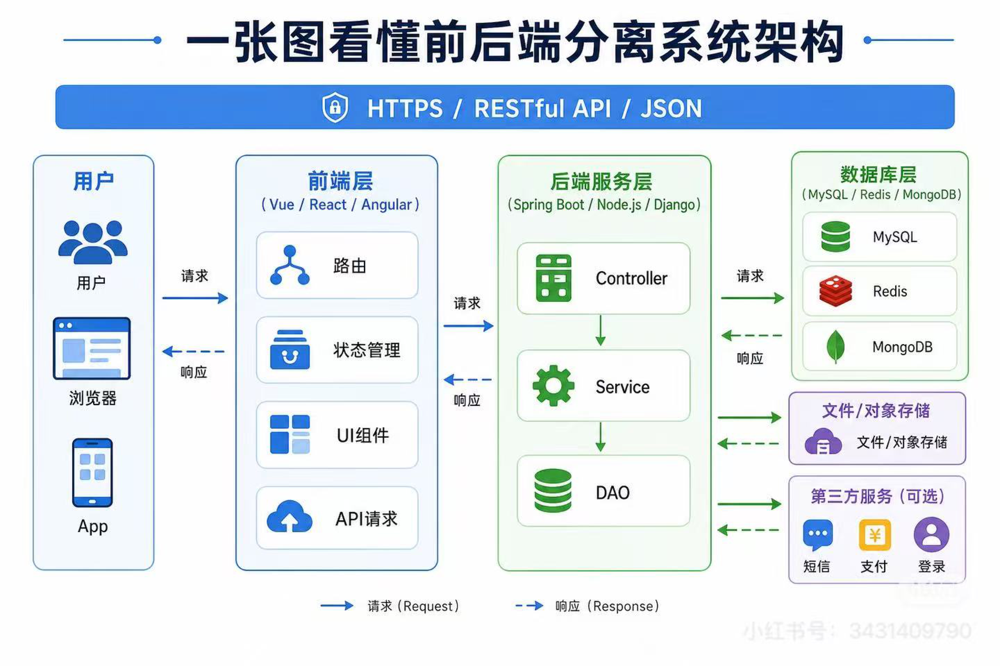

# 前端汇报 —— OCR 识别系统（一体化智慧储运分拣系统 · 前端层）

> 项目：OCR 识别系统 前端 · 版本 v3.2 · 日期：2026-08-26
> 线上地址：https://szhdsg609.github.io/ocr-web/

---

## 一、200 字汇报

本学期我负责「一体化智慧储运分拣系统」的前端开发。对照分工文档，我完成了前端层全部职责：UI 组件、状态管理、路由、API 调用与请求/响应处理，用原生 HTML/CSS/JS 实现了一个可独立运行的 OCR 识别网页。页面包含图片识别、视频识别、系统架构与关于四大视图，支持图片/视频上传、识别结果展示、历史记录（localStorage）与后端 API 配置对接；并已通过 GitHub Pages 静态部署上线，可通过公网直接访问。后续将与后端同学按 RESTful API 约定联调，把演示模式切换为真实 OCR 引擎识别，并进一步优化界面交互。

---

## 二、系统架构理解（对照分工.pdf）

系统采用**前后端分离**架构，本人负责其中的**前端层**：

```
       一体化智慧储运分拣系统架构
                 │
      HTTPS / RESTful API / JSON
                 │
┌────────┐  ┌──────────────┐  ┌──────────────┐  ┌──────────────┐
│ 用户/App│→│    前端层      │→│    后端服务    │→│   数据库层    │
│         │  │ Vue/React/   │  │ SpringBoot/  │  │ MySQL/Redis/ │
│         │  │ Angular      │  │ Node.js/     │  │ MongoDB      │
│         │  │ UI组件 状态管理│  │ Django       │  │ 文件存储 日志 │
│         │  │ 路由 API调用  │  │ Controller→  │  │ 消息队列 支付 │
└────────┘  └──────────────┘  │ Service→DAO  │  └──────────────┘
                              └──────────────┘
```

**前端层职责**：前端框架选型、UI 组件开发、状态管理、路由、API 调用（fetch 封装）、请求（Request）/响应（Response）处理。

---

## 三、已完成的前端工作

### 1. 前端页面开发（`ocr-web/` 独立项目）

| 文件 | 职责 |
|---|---|
| `index.html` | 主页面（单页应用 SPA，Tab 路由：图片/视频/系统架构/关于） |
| `css/style.css` | 现代简约、响应式样式（暗色结果区、卡片布局、上传组件） |
| `js/app.js` | 前端逻辑：路由、状态管理（localStorage）、API 调用封装、UI 交互 |

### 2. 前端四大职责落地

- **路由**：单页应用 Tab 视图切换，支持 `#hash` 直达页面
- **状态管理**：识别历史记录持久化到 localStorage（刷新不丢失）
- **API 调用**：`fetch` 封装（POST multipart/JSON），统一错误处理
- **请求/响应处理**：上传文件序列化、后端 JSON 解析、连接状态指示

### 3. 图片识别功能
- 图片上传（点击/拖拽）、预览、低显存模式参数
- 调用后端（Unlimited-OCR）识别 → 结果卡片展示 → 复制 / 下载 .txt
- 历史记录（名称 + 时间 + 查看）

### 4. 视频识别功能
- 视频上传 + 时段（起止时间/间隔）设置
- 调用后端（PaddleOCR）抽帧识别 → 表格展示（时间/上下数字/置信度）

### 5. 系统架构页
- 展示分工.pdf 提取的架构图 + 三层职责说明（前端/后端/数据库）

### 6. GitHub Pages 静态部署（已上线）
- 代码推送到 GitHub 仓库 `szhdsg609/ocr-web`（main 分支）
- 通过 GitHub API 开启 Pages（分支 main / 目录 /），状态 built
- **线上可访问：https://szhdsg609.github.io/ocr-web/**（HTTP 200，资源全部加载）

### 7. 本地 OCR 对接服务（可选）
- 提供 `api_server.py`：本地 RESTful API（端口 8000，含 CORS）
  - `GET /health`、`POST /api/recognize_image`、`POST /api/recognize_video`
- 已实测完整链路：前端 → API → Unlimited-OCR 模型 → 返回真实识别文本

---

## 四、效果图

### 图片识别页


### 视频识别页


### 系统架构页


### 关于页（后端对接配置）


### 系统架构图（分工.pdf 提取）


---

## 五、后续配合工作

### 1. 与后端团队联调
- 按 RESTful API / JSON 约定对齐接口（上传、识别、结果返回格式）
- 联调图片识别（Unlimited-OCR）与视频识别（PaddleOCR）真实引擎
- 处理真实接口的字段映射、错误码与异常提示

### 2. 部署与访问
- 线上静态站点已就绪（演示模式）；对接真实后端需：
  1. 后端部署到可公网访问的服务（或本机运行 `api_server.py`）
  2. 前端「关于」页配置 API 地址并「测试连接」
- 后续更新：`git add . && git commit && git push` 自动同步线上

### 3. 功能迭代方向
- 识别历史服务端化（由后端存储，替换 localStorage）
- 登录/权限（对接用户模块）
- 识别进度条、批量识别、结果导出 Excel
- 响应式与无障碍优化、主题切换

---

## 六、快速操作指南

| 操作 | 命令/说明 |
|---|---|
| 本地预览 | `cd ocr-web && python -m http.server 8080` → `http://127.0.0.1:8080` |
| 本地 OCR 后端 | `python ocr-web/api_server.py --port 8000`，前端配置 `http://127.0.0.1:8000` |
| 更新线上 | 在 `ocr-web/` 内 `git add . && git commit -m "更新" && git push` |
| 线上地址 | `https://szhdsg609.github.io/ocr-web/` |
